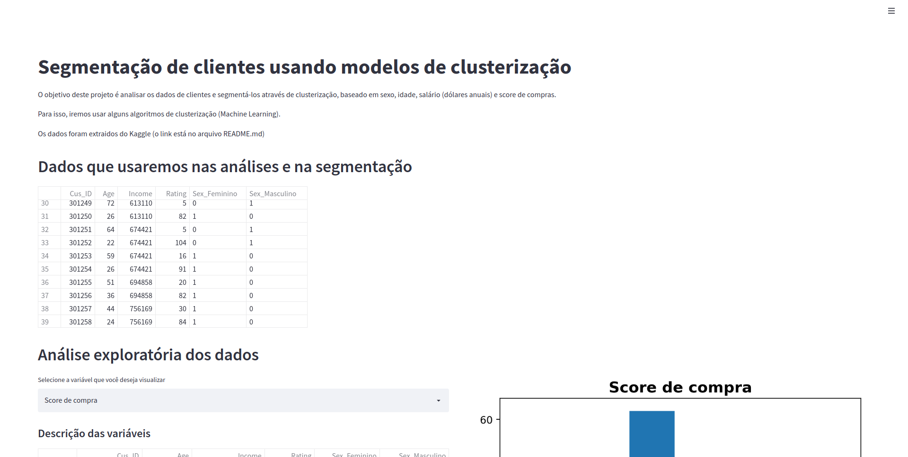
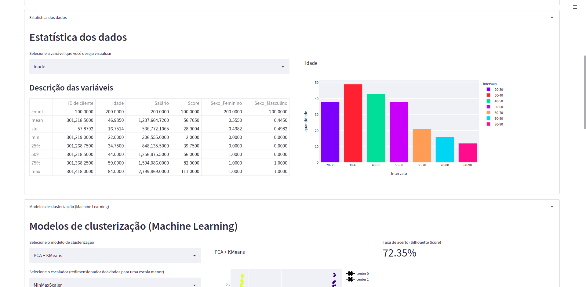
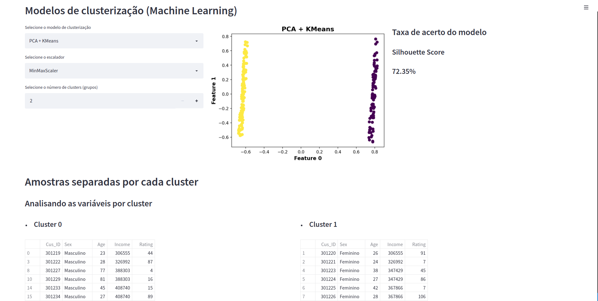
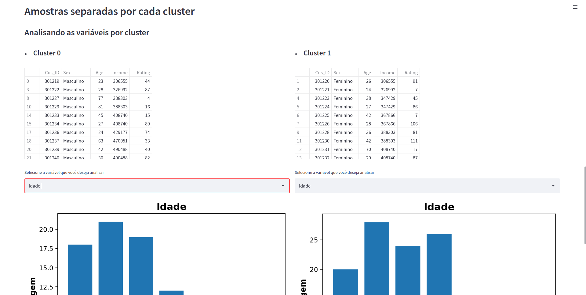
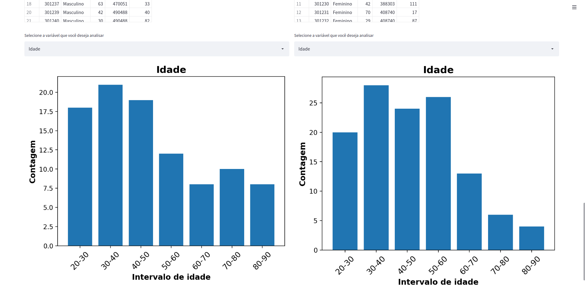

# Segmentação de clientes usando algoritmos de clusterização (Machine Learning)

## Objetivo
- O objetivo deste projeto é analisar os dados de clientes e segmentá-los através de modelos de clusterização, 
baseado em sexo, idade, salário (dólares anuais) e score de compras.

## Screenshots da página construída

    
    

    
    

    

## Comentários sobre o projeto
- Na parte onde você aplica algum algoritmo de clusterização, conforme você aumenta o número de clusters, automaticamente a página mostra os dados associados a cada cluster e os gráficos associados. Uma das (grandes) vantagens que você pode ter em relação a um Jupyter Notebook. 
- Para visualização da análise dos dados e das predições usando os algoritmos de Machine Learning, usei o pacote Streamlit, que permite que você crie uma página web dinâmica localmente onde você pode inserir qualquer coisa que use Python. Esta ferramenta não só facilita muito as análises dos dados como também permite com que o usuário possa interagir com a página. 
- Essa interatividade permite que usar Streamlit, em vários casos, seja melhor que usar Jupyter Notebook, que é um arquivo estático e dependendo da sua análise, pode acabar ficando muito longo para uma apresentação final.
- Alguns gráficos ficam enormes porque a página está com configuração layout = wide. Pretendo corrigir isso nos próximos projetos que irei desenvolver, pra ficar algo bem mais bonito e melhorar a experiência de usuário.
- O projeto está passível de melhorias, tanto na visualização de dados como no código fonte dele. Tive alguns pequenos problemas com o jeito que escrevi o código, porém quando lembrei de usar Programação Orientada a Objeto usando classes (como já fiz com o GoogleShoppingBot), eu já tinha escrito praticamente tudo o que precisava pra rodar o código. Fica de lição para próximos projetos.

## Recursos utilizados
- Visual Studio Code
- python3.8
- virtualenv
- pip3: gerenciador de pacotes python3.x

## Pacotes do Python
- streamlit
- pandas
- matplotlib.pyplot
- numpy
- sklearn (scikit-learn) 

## Algoritmos de clusterização usados
- Principal Component Analysis (PCA)
- PCA + KMeans
- PCA + Agglomerative Clustering
- PCA + DBSCAN

## Dataset usado para desenvolver o projeto
- https://www.kaggle.com/harshsoni7254/amazon-customer-segmentation

## Para executar esse arquivo localmente em sua máquina
- baixe esse repositório em sua máquina:
> git clone https://github.com/rafaelcoelho1409/CustomerSegmentation.git
- instale os pacotes necessários que estão no arquivo requirements.txt:
> pip3 install -r requirements.txt
- escolha seu interpretador python (python3, python3.x)  
- execute os seguintes comandos (para Linux):
> cd CustomerSegmentation  
> streamlit run customer_segmentation.py  
- Com esses comandos, a página será aberta automaticamente. Caso não abra, vá até seu navegador e digite:
> http://localhost:8501

## Melhorias a serem feitas
- Publicar a página no Streamlit ou no Heroku
- Inserir esse projeto dentro de um contâiner Docker